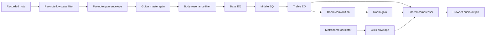

# Developing and tuning the guitar sound

This guide describes the current recorded-sample engine in [GuitarAudio.ts](../src/audio/GuitarAudio.ts). Read it before changing sustain, strumming, tone, or sample playback. The linked source files are the source of truth; update this guide when behavior or defaults change.

## How playback works

The engine loads MP3 guitar notes from [public/audio/guitar](../public/audio/guitar). For each requested MIDI note it picks the nearest recorded pitch, changes playback rate to reach the target pitch, and schedules a short attack and end fade. The recording supplies the natural decay; there is no looping oscillator sustaining the guitar indefinitely.

The audio connections are:



Guitar EQ affects the direct sound and the signal sent into the room effect. The metronome bypasses guitar gain, filters, and reverb, but shares the final compressor. Changes to that compressor can therefore affect both guitar and clicks. Neutral EQ means no *additional* bass/middle/treble gain; the body filter and per-note processing still apply.

## Files and responsibilities

| File | Responsibility |
| --- | --- |
| [src/audio/GuitarAudio.ts](../src/audio/GuitarAudio.ts) | Audio graph, sample loading, scheduling, voice tracking, cancellation, and live EQ |
| [src/constants/audio.ts](../src/constants/audio.ts) | Output, note, strum, room, and metronome settings |
| [src/data/guitarTone.ts](../src/data/guitarTone.ts) | EQ bands, neutral values, range, and smoothing |
| [src/components/GuitarToneControls.tsx](../src/components/GuitarToneControls.tsx) | Sliders and reset button; sends a complete tone object to `setTone` |
| [src/data/strumChords.ts](../src/data/strumChords.ts) | MIDI voicings used in Strum Studio |
| [src/data/strumPresets.ts](../src/data/strumPresets.ts) | Directions, accents, progression durations, and practice preset |
| [src/constants/studio.ts](../src/constants/studio.ts) | Tempo range, subdivisions, time signatures, and duration choices |
| [src/pages/StrumStudioPage.tsx](../src/pages/StrumStudioPage.tsx) | Sequences steps, selects the chord, and calls the audio engine |

## Units and when settings take effect

- Web Audio scheduling and envelope settings use **seconds**. The studio's interval timer uses **milliseconds**: `MILLISECONDS_PER_MINUTE / bpm / subdivisions`.
- Frequencies use **Hz**; `Db`/`DB` settings use **decibels**. Other gain/velocity values are **linear multipliers**, not percentages or dB.
- Detune uses **cents**. A `detuneRangeCents` of 3 currently produces approximately -1.5 to +1.5 cents because the random value is centered before multiplication.
- `Q` controls filter resonance/bandwidth. It is not a volume setting.
- Changing `setTone` applies smoothly to already-ringing notes. Changing source constants requires a reload for a reliable comparison: master gain, body filters, compressor, and room impulse are created once per engine instance.
- Each page owns an engine. Tone controls currently keep local state and reset when the page is remounted; settings are not saved across page navigation or reloads.

## Sound settings reference

The defaults below are the values at the time of writing. Tune one related group at a time and compare at similar listening volume.

### Strumming and dynamics

These settings are in `STRUM_PLAYBACK` in [audio.ts](../src/constants/audio.ts).

| Setting | Default | Effect |
| --- | --- | --- |
| `downstrokeGapSeconds` / `upstrokeGapSeconds` | 0.011 / 0.008 | Time between string attacks. Increase for a wider sweep; large gaps sound like an arpeggio. |
| `upstrokeStringCount` | 4 | Number of highest MIDI notes brushed on an upstroke. Downstrokes use the complete voicing. |
| `downstrokeVelocity` / `upstrokeVelocity` | 1 / 0.76 | Base strength of each direction. |
| `accentMultiplier` | 1.12 | Strength multiplier when a pattern step has an accent. |
| `velocityMinimum` / `velocityVariation` | 0.96 / 0.08 | Random strength variation shared by a stroke. |
| `gapMinimumMultiplier` / `gapVariation` | 0.85 / 0.3 | Random variation around the base string gap. |
| `leadingStringVelocity` / `trailingStringVelocityReduction` | 1.05 / 0.12 | Strength falls across the stroke. |
| `stringVelocityMinimum` / `stringVelocityVariation` | 0.97 / 0.06 | Additional small variation per note. |
| `detuneRangeCents` | 3 | Tiny pitch variation; large values can make chords sound out of tune. |

`startDelaySeconds` is scheduling lead time, not the space between strings. Avoid using it as a strum-speed control. Notes are ordered by MIDI pitch, and damping is keyed by MIDI note rather than physical string identity. Adding a true string/fret model would require changing both the voicing data and voice tracking.

### Sustain, fades, and attack

| Setting | Default | Effect |
| --- | --- | --- |
| `STRUM_PLAYBACK.repeatedStringReleaseSeconds` | 0.65 | How long the old note fades under a new strike of the same pitch. Longer values produce more overlap. |
| `STRUM_PLAYBACK.chordChangeReleaseSeconds` | 0.18 | Fade for notes absent from the next chord. Longer values allow more harmony overlap. |
| `NOTE_PLAYBACK.stopReleaseSeconds` | 0.025 | Short fade for an explicit Stop; keep this separate from musical sustain. |
| `NOTE_PLAYBACK.attackSeconds` / `attackVariationSeconds` | 0.003 / 0.002 | Fade-in and its random variation. Longer attacks soften the recorded pick transient. |
| `NOTE_PLAYBACK.endFadeSeconds` | 0.22 | Fade at the end of the available sample. This does not extend the recording. |
| `NOTE_PLAYBACK.minimumHoldSeconds` | 0.006 | Keeps the end-fade scheduling point after the normal short attack. Recheck this if lengthening attacks. |
| `NOTE_PLAYBACK.endStopPaddingSeconds` / `releaseStopPaddingSeconds` | 0.01 / 0.005 | Small scheduling gaps after fades before stopping a source. These do not add sustain. |

A `rest` pattern step is displayed as **Ring** and schedules no new guitar attack. It must not call `stop()`. A chord's beat duration controls when the sequencer moves to the next chord, not the duration of each audio buffer.

The current sample lifetime is `buffer.duration / playbackRate`. There is no fixed five-second cutoff. Increasing release times cannot create a missing tail in a short recording; use a longer suitable recording if the sample itself ends too early. Avoid looping the pick attack to create sustain.

### Brightness, EQ, body, and room

| Setting | Default | Effect |
| --- | --- | --- |
| `NOTE_PLAYBACK.brightnessHz` | 7400 | Initial low-pass cutoff for ordinary note playback. Strums provide their own cutoff. |
| `STRUM_PLAYBACK.baseBrightnessHz` / `velocityBrightnessHz` / `trailingStringBrightnessReductionHz` | 5400 / 2200 / 500 | Strum cutoff is `base + strokeVelocity * velocityBrightness - position * trailingReduction`. |
| `NOTE_PLAYBACK.sustainedBrightnessRatio` / `brightnessDecaySeconds` | 0.78 / 1.4 | How far and how quickly the cutoff falls after the attack. |
| `NOTE_PLAYBACK.lowpassQ` | 0.28 | Resonance of each note's low-pass filter. |
| `GUITAR_OUTPUT.bodyFrequencyHz` / `bodyGainDb` / `bodyQ` | 185 / 1.8 / 0.8 | Fixed body-resonance boost before the user EQ. |
| `ROOM_REVERB.durationSeconds` / `decayExponent` / `wetGain` | 0.72 / 2.8 / 0.085 | Length, decay shape, and level of the generated room impulse. More room sound is not a substitute for string sustain. |

User EQ is configured in [guitarTone.ts](../src/data/guitarTone.ts): bass is a 200 Hz low shelf, middle is an 800 Hz peaking filter, and treble is a 3200 Hz high shelf. `TONE_LIMIT` is ±12 dB, `TONE_STEP_DB` is 1 dB, and `TONE_SMOOTHING_SECONDS` is 0.015 seconds. The smoothing value is a time constant, not a hard completion deadline. `TONE_FILTER_Q` is currently 0.8; its bandwidth effect matters for the middle peaking band.

Use `setTone` for interactive changes; it clamps excessive values and treats non-finite values as neutral. If you change the default tone, keep the engine, slider initialization, reset behavior, and UI wording consistent.

### Level and compression

`GUITAR_OUTPUT.masterGain` is 0.62. Each note also uses `NOTE_PLAYBACK.gainMinimum` (0.7) plus `gainVariation` (0.045), multiplied by velocity and divided by the square root of chord size. Upstrokes use the complete chord size for this scaling even when they strike only the higher notes.

The compressor uses a -12 dB threshold, 12 dB knee, 4:1 ratio, 0.003-second attack, and 0.2-second release. These values live in `GUITAR_OUTPUT`. Stronger EQ boosts or longer overlapping tails can drive compression harder, so check dense chords and repeated strokes as well as isolated notes. A compressor is not a guarantee against clipping.

`METRONOME` settings affect click pitch, gain, and envelopes independently of the guitar tone. Keep `nearSilentGain` positive because the click uses exponential gain ramps.

## Practical adjustment recipes

These are starting experiments, not pre-tested replacement presets. Reset the UI EQ before comparing source-level changes.

| Goal | Try first | Listen for |
| --- | --- | --- |
| More continuous strumming | Increase `repeatedStringReleaseSeconds` slightly, for example from 0.65 to 0.75. | Smooth overlap without excessive buildup at fast tempos. |
| Clearer chord changes | Reduce `chordChangeReleaseSeconds` slightly. | Cleaner transitions without a chopped ending. |
| Brighter guitar | Try a small treble boost in the UI; then review strum cutoff settings if the default needs changing. | Pick detail without harshness; test single notes and chords separately. |
| Warmer guitar | Try a modest bass boost or treble cut in the UI. | Body without low-end mud on six-note chords. |
| Faster, tighter strokes | Reduce the two stroke gaps slightly. | A recognizable direction rather than nearly simultaneous notes. |
| Softer upstrokes | Lower `upstrokeVelocity`. | Audible contrast without losing the rhythm. |
| Less artificial variation | Reduce velocity/gap/detune variations independently. | More consistency without removing all expressive differences. |

Changing a constant should not require edits to unrelated components. If it does, check for a remaining duplicated number before adding another setting.

## Engine API and lifecycle

| Method | Caller responsibility and behavior |
| --- | --- |
| `prepare(): Promise<boolean>` | Call from the user-triggered start workflow. Loads/resumes audio and reports whether it is ready. |
| `play(midis, strum?)` | Plays simultaneous notes by default or a downstroke when `strum` is true. |
| `playStrum(midis, direction, accent?)` | Uses a full MIDI voicing, down/up direction, and optional accent. |
| `playMetronome(accent?)` | Schedules a short click directly into the shared compressor. |
| `setTone({ bass, middle, treble })` | Accepts a complete dB setting object. It can store values before audio starts without creating an audio context. |
| `stop()` | Cancels pending playback through a generation counter and fades tracked guitar voices, including tails already releasing. |

Sample loading is cached per engine instance. Playback methods handle errors internally through status messages and console warnings; callers should use `prepare()`'s boolean result when deciding whether to start a sequence.

Keep releasing guitar voices in the tracking set until `source.onended` disconnects their nodes. Removing them when their fade begins would prevent Stop from reaching those tails. The metronome oscillator is not in that set; an already-started click finishes its short envelope. The room output may also decay briefly after Stop.

Keep one engine in a React ref rather than constructing one on every render. `StrumStudioPage` handles pending-start cancellation, clears its interval through effect cleanup, and calls `stop()` on unmount. Preserve both the page request guard and engine generation guard when changing async startup. `stop()` does not close the audio context; a future disposal API needs its own lifecycle handling.

The sequencer currently uses `window.setInterval`, then the engine schedules each stroke against `AudioContext.currentTime`. It is not a look-ahead audio transport. If investigating timing drift under UI load or in background tabs, inspect the scheduler rather than compensating with different string gaps. Current 6/8 timing uses six numbered pulses; it does not implement a separate dotted-quarter tempo interpretation.

## Adding or replacing recordings

1. Add the audio under `public/audio/guitar/` and register its MIDI pitch and filename stem in the `SAMPLES` array in `GuitarAudio.ts`. Merely placing a file in the directory does not load it.
2. Confirm that the actual recorded pitch matches its MIDI entry. Playback uses the nearest registered sample and the ratio `2 ** ((targetMidi - sampleMidi) / 12)`.
3. Check the attack, silence at the start, full decay, tuning, and relative loudness against neighboring samples. Pitch-shifting upward also shortens the available tail.
4. Keep asset URLs rooted at `/audio/guitar/`. Check loading in development and the production preview.
5. Preserve or update [ATTRIBUTION.txt](../public/audio/guitar/ATTRIBUTION.txt) and the visible credits when the source or license changes. Its current text says the MP3 files are redistributed unchanged; revise that statement if you modify the recordings.
6. Update the sample-loading tests and any expectations affected by the new set. Do not raise gains to compensate for a mislabeled pitch or an unsuitable recording.

For a chord-voicing change, edit `strumChords.ts` rather than the sample registry. Keep playable MIDI voicings: pitch classes alone discard octave/register information and can sound unlike a guitar chord.

## Tests and troubleshooting

[GuitarAudio.test.ts](../src/audio/GuitarAudio.test.ts) uses fake Web Audio nodes and deterministic randomness to check sample reuse, strum order, timing, damping, full sample lifetime, tone routing, cancellation, and cleanup. [StrumStudioPage.test.tsx](../src/pages/StrumStudioPage.test.tsx) checks sequence timing, rests, accents, metronome behavior, presets, and live tone controls.

Run the focused tests during audio work:

```bash
npm test -- src/audio/GuitarAudio.test.ts src/pages/StrumStudioPage.test.tsx src/pages/ChordFinderPage.test.tsx
```

Then run all checks in [CONTRIBUTING.md](../CONTRIBUTING.md#verify-before-handing-off). When changing a sound default intentionally, revise affected assertions to express the intended audible behavior. Keep tests for note ordering, cancellation, cleanup, and smooth changes; changing all expectations to reference the same constants can hide regressions.

| Symptom | First checks |
| --- | --- |
| No sound or loading never finishes | User gesture, sample network responses, decode errors, browser audio support, and status messages. |
| Sustain sounds chopped | Same-note release, chord-change release, source duration, and accidental calls to Stop on ring steps. |
| Sound is muddy or pumps | Release overlap, low-frequency boosts, room level, and compressor settings. |
| Pick attack is missing | Sample leading silence, gain attack time, and per-note low-pass filtering. |
| Brightness change works on a fret but not a strum | Strums override `NOTE_PLAYBACK.brightnessHz`; check `STRUM_PLAYBACK` brightness settings. |
| Changing a constant has no audible effect | Reload to recreate the engine, reset UI EQ, and confirm which playback path uses the setting. |
| Loop starts after Stop or after leaving the page | Engine generation cancellation, page request guard, and effect cleanup. |

## Manual listening checks

Unit tests do not render or listen to real audio. Before handing off an audio implementation change:

1. Start with neutral EQ and a comfortable, consistent playback volume. Compare changes using the same playback device and musical settings.
2. Play isolated low and high frets. Let each ring to its natural ending; check pitch and attack.
3. Play C, G, Am, F, and Gm in Strum Studio. Compare downstrokes, upstrokes, accented steps, and ring steps.
4. Compare slow playback with fast sixteenth notes. Check both repeated chords and chord changes, including changes inside a bar.
5. Try bass, middle, and treble cuts/boosts while a chord rings. Reset the tone and confirm that the loop continues without an extra stroke.
6. Toggle the metronome. Confirm its numbered-beat timing and that EQ changes do not directly filter the click.
7. Stop during a ringing chord and during initial loading; then restart. Load a preset while playing and verify that playback stops until explicitly started again.
8. Run a production preview and repeat a short loop to confirm the build and sample URLs work together.

In the handoff, distinguish automated results from listening results. Include the settings changed, the reason, and any browser or sound-quality limitations still observed.
